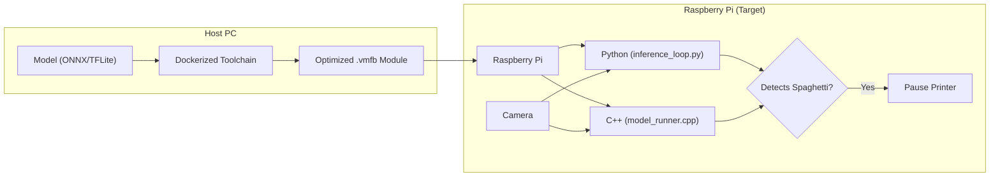

# KlipperCortex: Architecture and Flow Documentation

This document explains **how** the KlipperCortex system works, specifically focusing on how an Artificial Intelligence (AI) model is processed to run efficiently on a Raspberry Pi.

---

**See also:**

* [MCP Integration Guide](mcp_integration.md) - How to connect AI tools to your printer.

## 1. Overview

The objective is to perform low-latency inference on edge nodes like the Raspberry Pi to detect failed 3D prints ("spaghetti").
**The Challenge:** Running standard TFLite models on Pi CPUs can be slow due to limited compute resources.
**The Solution:** Use **IREE** to compile the model into a hardware-specific **VMFB** (Virtual Machine FlatBuffer) module, optimizing for your exact CPU (e.g., Cortex-A53 or Cortex-A7).

---

## 2. Key Terms

| Term | Description |
| :--- | :--- |
| **[MLIR](https://mlir.llvm.org/)** (Multi-Level Intermediate Representation) | A flexible intermediate representation that serves as a bridge between high-level frameworks (TensorFlow, PyTorch) and low-level hardware generation. |
| **[IREE](https://iree.dev/)** (Intermediate Representation Execution Environment) | An end-to-end runtime and compiler toolchain that uses MLIR to optimize models for specific hardware targets. |
| **VMFB** (Virtual Machine FlatBuffer) | The compiled output format of IREE. It contains the serialized bytecode and data for the model, optimized for the target architecture. |

---

## 3. The Architecture Flow

The entire process happens in two main stages: **Compilation** (on your PC) and **Inference** (on the Pi).

---

## 4. Compilation Process (Detailed)

This is where the model is **transformed**, not just copied. A "Modern Stack" approach is used to handle both legacy TFLite models and new ONNX models.

### Step 1: Environment (Docker)

To avoid dependency conflicts on the host machine, the entire toolchain is encapsulated in a Docker container (`iree-cross-compiler`). This container includes:

* **IREE Compiler**: Latest version (2024+) for optimal MLIR lowering.
* **TensorFlow**: Version 2.16.1 (CPU) for TFLite tools.
* **ONNX Tools**: `onnx` and `onnx2tf` for converting Open Neural Network Exchange models.

### Step 2: Normalization & Conversion

The build script `compile_aarch64.sh` automatically handles model format conversion:

**For ONNX Models:**

1. **Reading**: The script accepts a `.onnx` file (e.g., `model.onnx`).
2. **Conversion**: It uses `onnx2tf` to convert the ONNX graph into a clean TensorFlow Lite (TFLite) FlatBuffer.
    * **Crucial Detail**: The flag `-rtpo LeakyReLU` (Replace to Pseudo Operators) is used. This forces `onnx2tf` to decompose complex activation functions like `LeakyReLU` into standard math operations (Max, Mul) that are natively supported by the IREE compiler's TOSA dialect importer.
3. **Result**: A standard `model.tflite` file ready for import.

**For TFLite Models:**
Models already in `.tflite` format skip this step and proceed directly to importing.

### Step 3: Import to MLIR (TOSA)

The compiler translates the TFLite model into the **TOSA** (Tensor Operator Set Architecture) dialect of MLIR.

* **Tool**: `iree-import-tflite`
* **Output**: A `.mlir` text file representing the model's logic in high-level tensor operations.

### Step 4: Compilation to Bytecode (VMFB)

Finally, `iree-compile` lowers the TOSA MLIR to machine code LLVM IR, optimizes it, and serializes it into a VMFB module.

**Key Optimization Flags:**

* `--iree-hal-target-backends=llvm-cpu`: Targets the CPU backend (no GPU/Vulkan required).
* `--iree-llvmcpu-target-cpu=cortex-a53` (or `cortex-a7`): Enables specific LLVM optimizations for your target processor pipeline.
* `--iree-llvmcpu-target-triple=aarch64-linux-gnu` (or `arm-linux-gnueabihf`): Specifies the cross-compilation target.
* `--iree-opt-data-tiling`: Optimizes data access patterns for cache efficiency.

---

## 5. Inference Loop (Runtime)

Once the `.vmfb` file is deployed to the Raspberry Pi, you can use either the Python script `src/inference_loop.py` or the high-performance C++ runner `src/model_runner.cpp`.

### Python Loop (`inference_loop.py`)

Provides a feature-rich environment with easy integration for HTTP cameras and Moonraker lighting.

### C++ Runner (`model_runner.cpp`)

A lightweight, zero-overhead alternative for minimum latency. Ideal if you want to avoid installing the Python IREE runtime on the Pi.

### Runtime Features

1. **Hardware Abstraction**:
    * **Camera**: Supports both local USB cameras (`LocalCamera`) via OpenCV and network streams (`HTTPCamera`) typical in Klipper setups (MJPEG).
    * **Lighting**: Can trigger custom G-code (via Moonraker API) to turn on LED lights *only* during capture, ensuring consistent illumination.

2. **Configuration**:
    * Behavior is controlled via environment variables (e.g., `THRESHOLD`, `CAMERA_WIDTH`, `DRY_RUN`), making the system adaptable without code changes.

### Execution Flow in `inference_loop.py`

1. **Initialization**:
    * Loads the IREE runtime library.
    * Maps the compiled `.vmfb` module into memory.
    * Initializes connections to the camera and printer (Moonraker).

2. **The Loop (Every 5 seconds)**:
    * **Lighting On**: Sends G-code to illuminate the print bed.
    * **Wait**: Brief delay (0.5s) for auto-exposure adjustment.
    * **Capture**: Grabs a frame from the camera.
    * **Lighting Off**: Turns off the lights to save power/annoyance.
    * **Preprocessing**: Resizes image to `224x224` and normalizes pixel values to match model input requirements.

3. **Inference**:
    * Invokes the `predict` function on the IREE module.
    * This step executes the optimized AOT-compiled code on the Pi's CPU.

4. **Action**:
    * The model returns a confidence score (0.0 to 1.0).
    * If `confidence > THRESHOLD` (default 0.5), the script sends a `pause` command to the printer via Moonraker API.
    * **Cooldown**: The script sleeps for 60 seconds to prevent spamming pause commands.

---

## Summary

This architecture decouples the complex compilation process (handled by Docker on a powerful host) from the lightweight inference process (handled by the optimized VMFB module on the resource-constrained Pi).

* **Compilation**: LLVM-based optimizations ensure the model runs as fast as possible on the specific CPU.
* **Runtime**: A simple Python loop handles the orchestration, keeping dependencies minimal.
