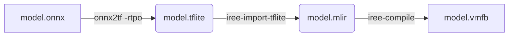

# Compiling Models (IREE)

This guide details the process for compiling ONNX and TFLite models into IREE-compatible VMFB modules optimized for specific architectures (like the Raspberry Pi 3B+ Cortex-A53 or older Pi 2 Cortex-A7).

## The Modern Stack

A "Modern Stack" approach is used to ensure compatibility with recent AI tools while maintaining performance on older hardware.

| Component | Version | Role |
| :--- | :--- | :--- |
| **IREE Compiler** | Latest (2024+) | Compiles MLIR/TOSA to VMFB bytecode. |
| **TensorFlow** | 2.16.1 (CPU) | Provides the TFLite-to-MLIR import tools. |
| **ONNX** | 1.16.1 | Parses input models. |
| **onnx2tf** | Latest | Converts ONNX to TFLite (handles complex ops). |
| **ai-edge-litert** | Latest | Runtime dependency. |

## Compilation Pipeline

The build process is automated by `scripts/compile_model.sh`.



1. **Normalization (ONNX -> TFLite)**: `onnx2tf` converts the model. Crucially, the flag `-rtpo LeakyReLU` is used to decompose complex activation functions into standard operations that play nicely with TOSA.
2. **Import (TFLite -> MLIR)**: `iree-import-tflite` translates the standard TFLite graph into the TOSA dialect.
3. **Compilation (MLIR -> VMFB)**: `iree-compile` generates the final bytecode module, targeting `llvm-cpu` with architecture-specific optimizations.

### Why Not Compile ONNX Directly?

You might wonder why the pipeline goes through `ONNX → TFLite → MLIR → VMFB` instead of using IREE's native ONNX frontend (`iree-import-onnx → iree-compile`). There are practical reasons for this detour:

**The TFLite importer is IREE's most battle-tested frontend.** IREE was originally developed with TFLite and Android edge devices in mind. The `iree-import-tflite` tool (which converts TFLite FlatBuffers into the TOSA MLIR dialect) is stable, well-optimized, and rarely fails. IREE's ONNX frontend, which relies on `torch-mlir`, is newer and frequently hits edge cases with vision model architectures.

**Complex activations break native MLIR lowering.** Models like `spaghetti_v2` (MobileNetV2-based) use activations like `LeakyReLU`. Passing an ONNX graph with these ops directly to IREE often produces "lowering errors" because the compiler lacks a direct optimized mapping for certain ONNX node structures to the target LLVM backend.

**`onnx2tf` acts as a sanitizer.** The `-rtpo LeakyReLU` flag forces `onnx2tf` to decompose complex ONNX operators into primitive math operations (e.g., `Max`, `Multiply`). When IREE receives this "sanitized" TFLite model, it sees only basic operations it can flawlessly optimize down to machine code.

A pure IREE-only pipeline is an ideal future goal, but today the TFLite bridge is the most reliable path to get vision models compiled for bare-metal ARM hardware without cryptic MLIR errors.

## Usage

### 1. Build the Docker Image

Avoid dependency issues by using the provided Docker container.

```bash
docker build -t iree-cross-compiler .
```

### 2. Compile a Model

The script `scripts/compile_model.sh` auto-detects `.onnx` or `.tflite` files. By default, it targets `cortex-a53` (Raspberry Pi 3/4/Zero 2W).

You can pass a second argument to compile for older hardware, such as `cortex-a7` for the Raspberry Pi 2!

**For ONNX (recommended):**

```bash
# Sourced from models/ directory
bash scripts/compile_model.sh models/model.onnx
# Or for a Raspberry Pi 2:
# bash scripts/compile_model.sh models/model.onnx cortex-a7
```

**For Legacy TFLite:**

```bash
bash scripts/compile_model.sh models/spaghetti_v2.tflite
# Or for a Raspberry Pi 2:
# bash scripts/compile_model.sh models/spaghetti_v2.tflite cortex-a7
```

### 3. Output

The compiled module is saved as `.vmfb` in the same directory as the input model, suffixed with the target architecture (e.g., `model_cortex-a7.vmfb`).
